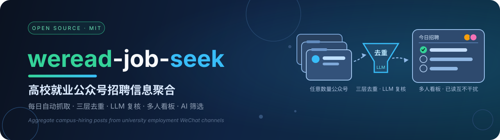
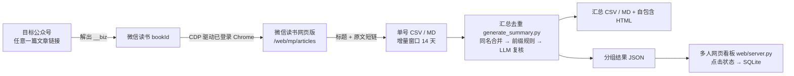

<div align="center">



# weread-job-seek

**自动追订高校就业公众号 · 每日聚合去重 · 多人看板协作**

[](https://www.python.org/)
[](https://nodejs.org/)
[](https://docs.astral.sh/uv/)
[](https://docs.docker.com/compose/)
[](#-工作原理)

[](./stargazers)
[](./forks)
[](./issues)
[](./commits)
[](./LICENSE)

**[🚀 快速开始](#-快速开始)** · **[✨ 功能特性](#-功能特性)** · **[🧩 工作原理](#-工作原理)** · **[🤖 告诉你的 Agent](#-告诉你的-agent)** · **[📚 更多文档](#-更多文档)** · **[⭐ 支持一下](#-支持这个项目)**

</div>

> 自动追订一批高校就业公众号，把每天的招聘推文聚合成一份按日期排列、重复只出现一次的清单，多人在网页看板上各自标记看过的条目。

## 💡 为什么做这个项目

求职季花时间最多的环节是找信息。招聘信息散落在十几个学校就业公众号里，每天得逐个翻。同一场招聘会，各校就业号都会转发一遍，标题前缀五花八门，看完记不住看过没有。几个人一起盯同一批号，谁读过什么也说不清。

这个项目把上面这些事交给机器：新推文每天自动入库，重复的合并成一条，看板上看过的打个勾，多设备、多人之间互不干扰。公众号数量不限——默认配置收录了 11 个高校就业公众号作为示例，在 `微信读书提取配置.json` 里可以换成任意数量的任何一批号。

## ✨ 功能特性

| 功能 | 说明 |
|---|---|
| 自动追订 | 每天增量拉取新推文，首次运行自动补齐全量历史 |
| 三层去重 | 规范化标题精确合并；仅差转发前缀/「启动」类后缀的走规则合并；剩余高相似候选交给 LLM 判定，内置品牌硬否决（阿里云与阿里巴巴集团分属不同招聘主体） |
| 断点续跑 | 被验证码或风控打断时，已抓到的内容先落盘，中断深度记入进度文件，下次自动续上 |
| 多人看板 | 用户名加访问码登录，点击状态存服务端 SQLite；同一组重复文章点过任一来源即整组标为已读；页面 15 秒自动同步 |
| AI 筛选 | 按日期或全量批量抓正文、解码海报二维码，GLM（10 并发）判定是否计算机类招聘并提取岗位/地点/报名链接；分析全员复用，每位用户的意向城市与方向关键词独立记忆，看板可只看「符合我的筛选」 |
| 多形态输出 | 单号 CSV/MD、合并汇总 CSV/MD、单文件自包含 HTML 报告，可直接转发到群里 |
| 一键部署 | Docker Compose 常驻并随系统自启；不用 Docker 也能纯命令行跑 |
| 轻依赖 | 网页服务只用 Python 标准库；AI 筛选另需 zxing-cpp 与 pillow（缺失时自动降级为纯文本分析）；抓取只需要一个登录过微信读书的 Chrome |

## 🧩 工作原理



1. **公众号到 bookId**：每个公众号给任意一篇公开文章链接，脚本从页面解出 `__biz`，换算成微信读书的 `bookId=MP_WXS_<...>`。微信读书网页版把公众号收录为可订阅的"书籍"，文章列表接口公开返回标题和原文链接，抓取这一步走的就是这条路。
2. **CDP 驱动 Chrome**：专用脚本启动固定 Profile、开放调试端口（主力 9223、备用 9224）的 Chrome，人工登录微信读书一次，之后全自动。
3. **增量抓取**：默认只翻最近 14 天，遇到整页都已收录就停，请求数少、不易触发风控；每周跑一次 `--deep` 深扫，补齐微信读书的回填旧文。
4. **汇总去重**：读入全部单号 CSV，先做规范化标题的精确合并，再按转发前缀规则合并，品牌硬否决筛掉不同招聘主体的误合并，剩余候选对按批并发交给 OpenAI 兼容端点判定，最后并查集成组。判定结果逐对缓存，次日只判新增。
5. **网页看板**：直接读分组 JSON 渲染，点击行为写 SQLite，不参与抓取与去重逻辑。可选的 AI 筛选（`web/screen_update.py`）在同一界面按日期识别计算机类岗位，结果写 `web/data/screen_results.json` 供看板合并展示。

## 🚀 快速开始

### 第一步：先把看板跑起来看看效果

仓库自带一份数据快照，不需要 Chrome、不需要 API Key，三条命令就能看到网站长什么样：

```sh
git clone https://github.com/dw763j/weread-job-seek.git
cd weread-job-seek

# 创建一个看板账号，终端会打印一次性访问码
python3 web/server.py add-user me --name 我

# 启动看板
python3 web/server.py serve
```

浏览器打开 <http://127.0.0.1:8787>，用刚才的用户名和访问码登录——按日期的招聘清单、已读打勾、收藏与投递管理、AI 筛选视图，快照数据上的全部功能都能点。网页服务只用 Python 标准库（Python 3.12+ 即可，无需先装依赖）；用 uv 的话 `uv run python web/server.py serve` 等价。局域网多人访问加 `--host 0.0.0.0`。

想长期部署在服务器上，用 Docker：

```sh
docker compose up -d --build        # 监听 0.0.0.0:8888，随系统自启
```

### 第二步：让数据变成你自己的

看板展示的是仓库里的快照。要追订你自己的一批公众号并每天更新，先在 `微信读书提取配置.json` 里换成你的公众号列表，然后跑通一次抓取流水线（之后可交给 Agent 或定时任务，见[下节](#-告诉你的-agent)）：

```sh
# 0) 安装依赖（Python 侧用 uv 管理）
uv sync

# 1) 启动专用 Chrome 并登录微信读书（只需一次）
./start_weread_chrome.sh            # 主力账号，CDP 端口 9223
./start_weread_chrome_backup.sh     # 备用账号（可选），CDP 端口 9224

# 2) 确认登录态，然后抓取
node weread_extract.mjs 9223 --check-session
node weread_extract.mjs 9223          # 日常增量
node weread_extract.mjs 9223 --deep   # 每周全量深扫

# 3) 生成汇总（抓取结束后脚本也会自动执行）
uv run python generate_summary.py --range 20260710-99999999

# 4) AI 筛选（可选；需要 .env 里的 API Key，缺 zxing-cpp/pillow 时自动降级）
uv run python web/screen_update.py --all
```

## 🤖 告诉你的 Agent

这套流程完全可以让编码 Agent（Claude Code、ZCode、Codex 等）代跑。仓库根目录的 [AGENTS.md](./AGENTS.md) 就是一份现成的操作手册，主流 Agent 启动时会自动读取它；里面写清了每天更新的固定动作和风控应对：先请你在专用 Chrome 窗口完成验证码，再跑 `node weread_extract.mjs 9223`，抓完自动生成汇总；接口返回 `-2041` 时停下来等人工验证，返回 `-2014` 时换 9224 备用账号补跑。

想让它定时干活，给它一段这样的任务描述即可：

```text
每天早上 9 点提醒我先去专用 Chrome 完成验证码。
我确认后运行 node weread_extract.mjs 9223。
跑完读 output/weread_extract/运行报告.json，汇报各号新增条数。
日志里出现 -2041 就停下来等我完成验证码再补跑；
出现 -2014 就改用 9224 备用账号补跑剩余账号。
```

## 🔧 配置

| 配置 | 说明 |
|---|---|
| `微信读书提取配置.json` | 目标公众号列表：名称 + 该号任意一篇文章的公开链接（有同名歧义时加 `backup_url`） |
| `.env`（参考 `.env.example`） | 去重端点：`DEDUP_API_BASE` / `DEDUP_MODEL` / `DEDUP_API_KEY`，任何 OpenAI 兼容接口均可 |
| `--crawl-days N` / `WR_CRAWL_DAYS` | 增量抓取窗口（默认 14 天） |

## 📤 输出文件

| 文件 | 说明 |
|---|---|
| `output/weread_extract/<公众号名>.csv` / `.md` | 单号全量文章（发布日期、标题、链接） |
| `output/weread_extract/汇总-全部公众号.csv` / `.md` | 多号合并、按日期倒序、去重组展示 |
| `output/微信读书汇总-<起止>.html` | 自包含 HTML 报告，可直接分发 |
| `output/weread_extract/汇总-去重组.json` | 分组结果 + 逐对判定缓存（下次复用） |
| `output/weread_extract/进度.json` / `运行报告.json` | 断点进度与每次运行报告 |

## 📁 目录结构

```
├── weread_extract.mjs            # 主抓取脚本（Node，CDP 驱动 Chrome）
├── start_weread_chrome.sh        # 启动专用 Chrome（主力 / 备用）
├── start_weread_chrome_backup.sh
├── 微信读书提取配置.json          # 目标公众号配置
├── generate_summary.py           # 汇总去重（规则 + LLM）
├── extract_wechat_articles.py    # 备选数据源：从微信桌面端缓存 SQLite 提取
├── write_scan_ledger.py          # 扫描台账（断点续扫）
├── background_orchestrator.sh    # 后台编排：冷却 → 补跑 → 起网页服务
├── web/                          # 多人网页看板（纯标准库）
│   ├── server.py
│   ├── static/
│   └── data/                     # SQLite（用户与点击记录）
├── assets/                       # README 用图（banner / Star 卡片）
├── docker-compose.yaml / Dockerfile
└── output/                       # 输出目录
```

## 🚨 使用注意与风控

- 微信读书对高频访问会弹验证码（接口返回 `-2041`）：停下来，去专用 Chrome 窗口完成验证码再续跑，断点已自动保存。接口返回 `-2014`（账号被标记）时，换备用账号窗口补跑剩余账号。
- 增量窗口不要随意调大。翻穿全号是触发风控的主要原因，14 天窗口加每周一次 `--deep` 是实测下来比较稳的节奏。
- 仅供个人学习与研究，请控制频率，遵守微信读书与微信公众平台的服务条款；由此产生的账号风险自行承担。

## 📚 更多文档

- [微信读书全量提取流程.md](./微信读书全量提取流程.md)，抓取/汇总的完整流程、参数与风控处理细节
- [Ubuntu24.04部署说明.md](./Ubuntu24.04部署说明.md)，从零部署（Chrome、uv、Docker、定时任务）
- [web/README.md](./web/README.md)，网页看板的设计细节（账号体系、点击状态同步、容器化）
- [每日更新说明.md](./每日更新说明.md)，旧版「微信桌面端缓存提取」流程说明

## ⭐ 支持这个项目

<div align="center">


**如果这个项目帮你的求职季省下了翻公众号的时间，点一个 Star 就是对它最好的支持**——Star 数是项目是否值得持续维护、数据是否值得每日更新的最直接信号。

[](https://github.com/dw763j/weread-job-seek/stargazers)

[](https://star-history.com/#dw763j/weread-job-seek&Date)

</div>

## 📄 声明

本项目与腾讯、微信读书、微信公众平台无任何关联；所有文章链接均来自微信读书网页版公开接口的返回结果，版权归原公众号所有。招聘信息以各官方公众号原文为准。

---

<div align="center">

**MIT License** © 2026 [dw763j](https://github.com/dw763j)

</div>
